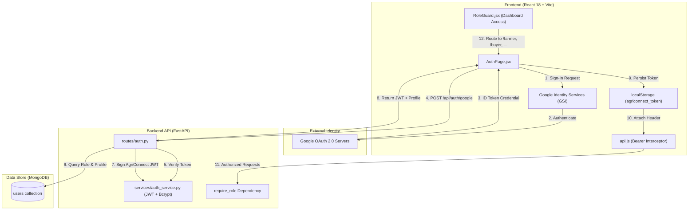
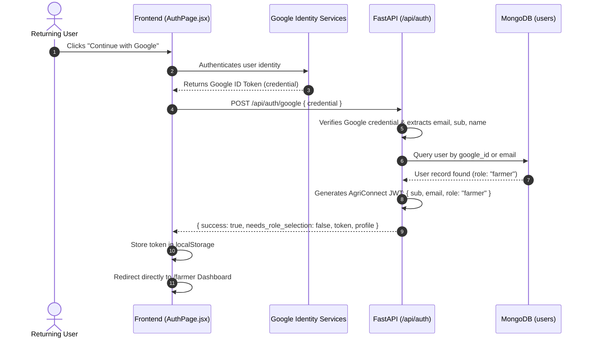
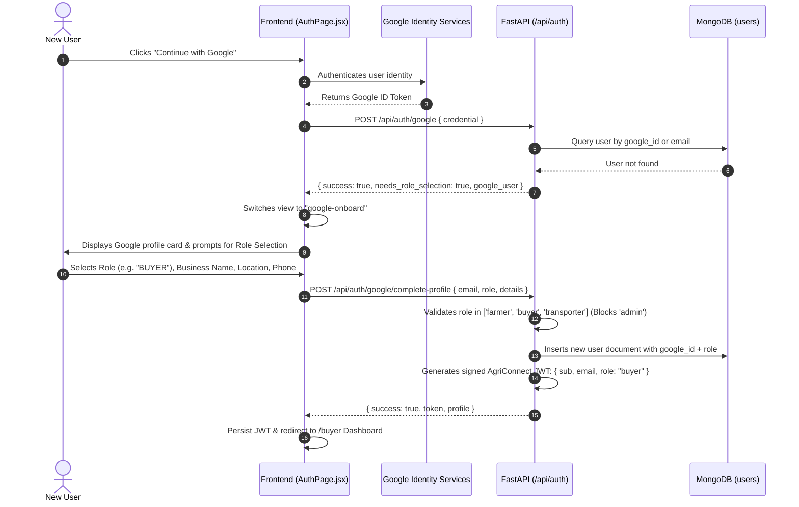

# AgriConnect — Authentication & Role Segregation Workflow

This document provides a comprehensive technical guide to the authentication architecture in AgriConnect, detailing the hybrid **Google OAuth 2.0 + FastAPI JWT (JSON Web Token)** model, role segregation logic, database persistence with MongoDB, and protected route enforcement.

---

## 📑 Table of Contents
1. [Architecture Overview](#1-architecture-overview)
2. [Dual Authentication Model](#2-dual-authentication-model)
3. [Workflow A: Google OAuth 2.0 Flow](#3-workflow-a-google-oauth-20-flow)
   - [A1. Returning Google User (Direct Login)](#a1-returning-google-user-direct-login)
   - [A2. First-Time Google User (Onboarding & Role Selection)](#a2-first-time-google-user-onboarding--role-selection)
4. [Workflow B: Email & Password Flow](#4-workflow-b-email--password-flow)
   - [B1. Standard Registration](#b1-standard-registration)
   - [B2. Standard Login](#b2-standard-login)
   - [B3. Protected Admin Login](#b3-protected-admin-login)
5. [Role-Based Access Control (RBAC) Enforcement](#5-role-based-access-control-rbac-enforcement)
   - [Frontend Guarding (`RoleGuard.jsx`)](#frontend-guarding-roleguardjsx)
   - [Backend Guarding (`require_role`)](#backend-guarding-require_role)
6. [API Specifications & Contracts](#6-api-specifications--contracts)
7. [Token Structure & Security](#7-token-structure--security)
8. [Configuration & Environment Variables](#8-configuration--environment-variables)

---

## 1. Architecture Overview



---

## 2. Dual Authentication Model

AgriConnect decouples **Identity Verification** from **Application Authorization**:

| Component | Responsibility | Implementation |
| :--- | :--- | :--- |
| **Identity (AuthN)** | Verifies *who* the user is. | **Google OAuth 2.0** or **Email/Password** |
| **Authorization (AuthZ)** | Determines *what* the user can access (**Farmer**, **Buyer**, **Transporter**, or **Admin**). | **MongoDB User Document** + **Signed AgriConnect JWT** |

---

## 3. Workflow A: Google OAuth 2.0 Flow

Google authentication allows passwordless entry. Because Google does not store agricultural domain roles, AgriConnect executes a dual-branch evaluation:

### A1. Returning Google User (Direct Login)
When an existing user signs in with Google, their profile already exists in MongoDB with an assigned role.



---

### A2. First-Time Google User (Onboarding & Role Selection)
When a Google account signs in for the very first time, they must complete onboarding to select their agricultural role.



---

## 4. Workflow B: Email & Password Flow

For users opting not to use Google, native email and password registration and login are provided.

### B1. Standard Registration
1. User enters **Full Name**, **Mobile**, **Email**, **Password**, **Location**, and selects **Account Type** (`Farmer`, `Buyer`, or `Transporter`).
2. Role-specific fields are dynamically required:
   - **Farmer**: Produce Categories, Farm details.
   - **Buyer**: Business/Company Name, Required produce.
   - **Transporter**: Vehicle Type, Vehicle Capacity.
3. Frontend sends `POST /api/auth/register`.
4. Backend hashes password via `bcrypt`, saves document to MongoDB, and returns a signed JWT.

### B2. Standard Login
1. User enters **Email Address** and **Password**.
2. Frontend sends `POST /api/auth/login`.
3. Backend retrieves user from MongoDB, checks password hash with `verify_password()`.
4. If valid, generates a signed JWT encoded with the user's role. If invalid, returns `401 Unauthorized`.

### B3. Protected Admin Login
* Admin accounts **cannot be created via public registration** (the backend strictly rejects `role: "admin"` during sign-up).
* The predefined Administrator account uses:
  - **Email**: `admin@agriconnect.com`
  - **Password**: `AgriConnect@Admin2026`
* Upon successful authentication, the backend signs a JWT with `role: "admin"`, granting access to `/admin` control tower.

---

## 5. Role-Based Access Control (RBAC) Enforcement

### Frontend Guarding (`RoleGuard.jsx`)
Protected pages in [`frontend/src/components/RoleGuard.jsx`](file:///c:/Users/Dell/OneDrive/Desktop/Project/frontend/src/components/RoleGuard.jsx) check whether the user's active session role matches the target route:

```javascript
// Example check inside RoleGuard.jsx
const isAllowed = isPageAllowed(userRole, targetPage);
if (!isAllowed) {
  return <AccessRestricted userRole={userRole} targetPage={targetPage} onRedirect={setPage} />;
}
```

### Backend Guarding (`require_role`)
FastAPI endpoints utilize the `require_role` dependency in [`backend/routes/auth.py`](file:///c:/Users/Dell/OneDrive/Desktop/Project/backend/routes/auth.py):

```python
@router.get("/admin/analytics")
async def get_analytics(role: str = Depends(require_role("admin"))):
    # Only requests with a valid JWT having role == "admin" can reach this logic
    return db.get_admin_stats()
```

---

## 6. API Specifications & Contracts

### 1. `POST /api/auth/google`
Authenticates a Google identity.
* **Request Body**:
  ```json
  {
    "credential": "<GOOGLE_ID_TOKEN_JWT>"
  }
  ```
  *(Or direct payload `{ "email": "user@gmail.com", "name": "Name", "google_id": "..." }`)*
* **Response (Existing User)**:
  ```json
  {
    "success": true,
    "needs_role_selection": false,
    "token": "eyJhbGciOiJIUzI1NiIsIn...",
    "profile": {
      "id": "USR-FARMER-102",
      "full_name": "Ravi Kumar",
      "email": "user@gmail.com",
      "role": "farmer",
      "location": "Melur, Madurai"
    }
  }
  ```
* **Response (New User)**:
  ```json
  {
    "success": true,
    "needs_role_selection": true,
    "google_user": {
      "email": "user@gmail.com",
      "full_name": "Ravi Kumar",
      "google_id": "10823910293...",
      "picture": "https://..."
    }
  }
  ```

---

### 2. `POST /api/auth/google/complete-profile`
Completes role onboarding for first-time Google users.
* **Request Body**:
  ```json
  {
    "email": "user@gmail.com",
    "role": "farmer",
    "full_name": "Ravi Kumar",
    "phone": "9876543210",
    "location": "Melur, Madurai",
    "google_id": "10823910293...",
    "picture": "https://...",
    "extra_fields": {
      "produce_categories": ["Tomato", "Chilli"],
      "farm_details": "10 Acres"
    }
  }
  ```
* **Response**:
  ```json
  {
    "success": true,
    "message": "Welcome to AgriConnect as FARMER!",
    "token": "eyJhbGciOiJIUzI1NiIsIn...",
    "profile": { ... }
  }
  ```

---

### 3. `POST /api/auth/login`
Email and password login.
* **Request Body**:
  ```json
  {
    "email": "farmer@agriconnect.org",
    "password": "mypassword"
  }
  ```
* **Response (Success)**: `200 OK` with `{ "success": true, "token": "...", "profile": { ... } }`
* **Response (Failure)**: `401 Unauthorized` with `{ "detail": "Invalid email or password." }`

---

### 4. `POST /api/auth/register`
Native public registration.
* **Request Body**:
  ```json
  {
    "full_name": "Suresh Raj",
    "email": "suresh@buyer.com",
    "phone": "9123456780",
    "password": "securepassword",
    "role": "buyer",
    "location": "Madurai Town",
    "extra_fields": {
      "business_name": "Madurai Fresh Mart",
      "required_categories": ["Tomato", "Potato"]
    }
  }
  ```
* **Response**: `200 OK` with `{ "success": true, "token": "...", "profile": { ... } }`

---

### 5. `GET /api/auth/me`
Validates active JWT session and retrieves user profile.
* **Headers**: `Authorization: Bearer <token>`
* **Response**: `200 OK` with `{ "user": { "id": "...", "role": "farmer", "email": "..." } }`

---

## 7. Token Structure & Security

AgriConnect issues **HS256** signed JWTs.

### JWT Header:
```json
{
  "alg": "HS256",
  "typ": "JWT"
}
```

### JWT Payload:
```json
{
  "sub": "USR-FARMER-102",
  "email": "farmer@agriconnect.org",
  "role": "farmer",
  "name": "Ravi Kumar",
  "iat": 1726560000,
  "exp": 1727164800
}
```

* **Token Storage**: Persisted in browser `localStorage` under `agriconnect_token`.
* **Automatic Attachment**: Attached to all outgoing API requests by [`frontend/src/services/api.js`](file:///c:/Users/Dell/OneDrive/Desktop/Project/frontend/src/services/api.js) via the `Authorization: Bearer <token>` header.
* **Password Hashing**: Passwords are cryptographically salted and hashed using **Bcrypt** (`passlib.context`).

---

## 8. Configuration & Environment Variables

### Backend (`backend/.env`)
```env
# MongoDB Connection
MONGODB_URI=mongodb://localhost:27017
MONGODB_DB_NAME=agriconnect

# JWT Secret & Expiry
JWT_SECRET=agriconnect-jwt-secret-key-2026-production
JWT_ALGORITHM=HS256
ACCESS_TOKEN_EXPIRE_MINUTES=10080

# Google OAuth 2.0 (from Google Cloud Console)
GOOGLE_CLIENT_ID=your_google_client_id.apps.googleusercontent.com
```

### Frontend (`frontend/.env`)
```env
# Backend URL (Empty uses Vite proxy to localhost:8000)
VITE_API_URL=

# Google OAuth 2.0 (Must match backend Client ID)
VITE_GOOGLE_CLIENT_ID=your_google_client_id.apps.googleusercontent.com
```
