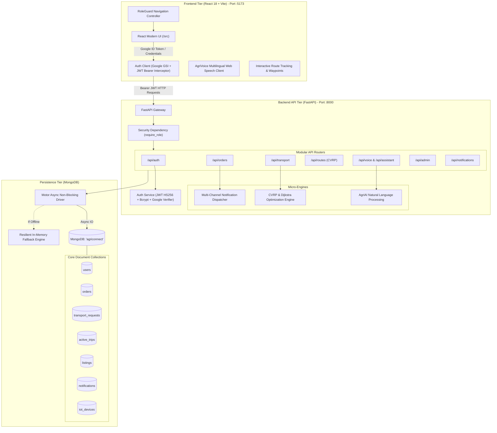

<div align="center">

# 🌾 AgriConnect

### *Next-Generation Agricultural Supply Chain & Logistics Ecosystem*

[-10B981?style=for-the-badge)](https://fastapi.tiangolo.com)
[](https://fastapi.tiangolo.com)
[](https://react.dev)
[](https://vitejs.dev)
[](https://www.mongodb.com)
[](https://jwt.io)
[](LICENSE)

<p align="center">
  A high-concurrency, asynchronous digital agriculture marketplace and intelligent logistics platform. 
  <br />
  Empowering <b>Farmers</b> with direct-to-buyer trade, providing <b>Buyers</b> with verified bulk sourcing, equipping <b>Transporters</b> with algorithmic fleet routing, and arming <b>Administrators</b> with end-to-end supply chain governance.
</p>

[Quick Start](#-quick-start-guide) •
[System Architecture](#-system-architecture) •
[Stakeholder Portals](#-stakeholder-portals--rbac) •
[Authentication Workflow](#-authentication--security-model) •
[API Reference](#-api-endpoints--swagger-docs) •
[Full Auth Docs](AUTHENTICATION.md)

---

</div>

## 📑 Table of Contents

1. [Platform Vision & Core Innovations](#-platform-vision--core-innovations)
2. [Stakeholder Portals & RBAC](#-stakeholder-portals--rbac)
3. [System Architecture](#-system-architecture)
4. [Technology Stack](#-technology-stack)
5. [Authentication & Security Model](#-authentication--security-model)
6. [Project Directory Layout](#-project-directory-layout)
7. [Quick Start Guide](#-quick-start-guide)
8. [End-to-End Operational Lifecycle](#-end-to-end-operational-lifecycle)
9. [API Endpoints & Swagger Docs](#-api-endpoints--swagger-docs)
10. [Configuration & Environment Variables](#-configuration--environment-variables)
11. [Production Deployment](#-production-deployment)
12. [License](#-license)

---

## 🌟 Platform Vision & Core Innovations

Traditional agricultural supply chains suffer from predatory intermediaries, lack of transparent price discovery, high post-harvest transit losses, and disjointed transport coordination. **AgriConnect** eliminates these inefficiencies through a unified digital platform:

* 🌾 **Direct Farmer-to-Buyer Marketplace**: Farmers list crops with real-time MSP guidance, quality grades, and harvest dates. Commercial buyers place orders or negotiate bids directly without middlemen.
* ⚡ **Automated Logistics State Machine**: When a farmer accepts an order, the system automatically triggers a **Transport Request** (`WAITING_FOR_TRANSPORT`), calculating weight, pallet volume, and pickup deadlines.
* 🚚 **Fleet Route Optimization (CVRP & Dijkstra)**: Transporters accept delivery contracts optimized via Google Maps and Capacitated Vehicle Routing Problem (CVRP) heuristics, reducing empty runs and fuel burn.
* 🗣️ **Multilingual AI Voice Assistant (AgriAI)**: Accessible browser-based voice synthesis and speech recognition in **7 regional languages** (Tamil, Hindi, Telugu, Kannada, Malayalam, Bengali, English) enabling accessible voice commerce.
* ❄️ **IoT Cold Storage & Spoilage Prevention**: Telemetry tracking of transit humidity and temperature conditions, flagging risks before perishables degrade.
* 🛡️ **Zero-Compromise Security**: Enterprise-grade **Google OAuth 2.0** identity verification combined with **FastAPI JWT RBAC** tokens, cryptographic Bcrypt password hashing, and zero hardcoded demo bypasses.

---

## 👥 Stakeholder Portals & RBAC

AgriConnect enforces strict **Role-Based Access Control (RBAC)** across four dedicated user personas:

| Portal | Target Persona | Primary Responsibilities & Features | Route Guard |
| :--- | :--- | :--- | :--- |
| **🌾 Farmer Portal** | Cultivators & Agricultural Co-ops | Harvest inventory management, lot pricing, incoming buyer bid review, pickup scheduling, and earnings settlements. | `/farmer` |
| **🏢 Buyer Portal** | Wholesalers, Retailers, Exporters | Regional produce discovery, certified quality filters, bulk order placement, real-time shipment tracking, and logistics coordination. | `/buyer` |
| **🚚 Transporter Portal** | Logistics Providers & Fleet Owners | Dynamic transport marketplace, load capacity matching, multi-stop GPS waypoint optimization, and delivery verification. | `/transporter` |
| **🛡️ Admin Control Tower** | Platform Governance & Compliance | Cross-network transaction audit trails, platform GMV analytics, cold storage telemetry monitoring, and user authorization management. | `/admin` |

---

## 🏛️ System Architecture

The application is architected around a decoupled **FARM (FastAPI, React, MongoDB)** architecture with an asynchronous, event-driven data flow:



---

## 🛠️ Technology Stack

### Frontend
- **Framework**: [React 18.3](https://react.dev/) (Hooks, Context, Functional Architecture)
- **Bundler & Dev Server**: [Vite 6.0](https://vitejs.dev/) with hot module replacement (HMR)
- **Icons & Visuals**: [Lucide React](https://lucide.dev/) (Production SVG iconography)
- **Styling**: Tailored Modern CSS Design System (Glassmorphism, Vibrant Agri-Palette, Fully Responsive)
- **External Integrations**: Google Identity Services (GSI), Web Speech STT/TTS API

### Backend
- **Framework**: [FastAPI 0.100+](https://fastapi.tiangolo.com/) (Asynchronous ASGI Web Framework)
- **Server**: [Uvicorn](https://www.uvicorn.org/) (High-performance ASGI server)
- **Database Driver**: [Motor 3.3+](https://motor.readthedocs.io/) (Asynchronous non-blocking MongoDB client) & [PyMongo 4.6+](https://pymongo.readthedocs.io/)
- **Data Modeling & Validation**: [Pydantic v2](https://docs.pydantic.dev/)
- **Security & Cryptography**: [PyJWT](https://pyjwt.readthedocs.io/) (HS256 tokens), [Passlib](https://passlib.readthedocs.io/) with [Bcrypt](https://pypi.org/project/bcrypt/)
- **OAuth Identity**: [Google Auth Library](https://pypi.org/project/google-auth/)
- **Operations Research**: Algorithmic CVRP & Dijkstra Route Planning Engine

---

## 🔐 Authentication & Security Model

AgriConnect implements a hybrid authentication paradigm that separates **Identity Authentication (AuthN)** from **Application Authorization (AuthZ)**:

```
[Google OAuth 2.0 / Email-Password] ──(Identity)──▶ [FastAPI Backend] ──(Query Role)──▶ [MongoDB]
                                                                                              │
[Protected Dashboard Routes] ◀──(RBAC Verification)── [AgriConnect JWT Token] ◀──────────────┘
```

1. **Google OAuth 2.0 (Passwordless)**:
   - Returning Google users are authenticated and routed directly to their role-specific dashboard.
   - First-time Google users transition into an intuitive **Role Onboarding Screen** to designate their role (`FARMER`, `BUYER`, or `TRANSPORTER`) and capture agricultural or logistics credentials.
2. **Standard Email & Password**:
   - Cryptographically salted and hashed using **Bcrypt** (`passlib.context`).
   - Rejects unauthenticated requests with clean `401 Unauthorized` responses.
3. **Privilege Escalation Prevention**:
   - The `admin` role is strictly locked out from public registration and Google onboarding.
   - Platform administration requires designated, pre-authenticated administrator credentials (`admin@agriconnect.com`).
4. **Token Handling**:
   - Issued tokens are signed with **HS256**, packed with user ID and role claims, and automatically attached to outgoing HTTP requests via `Authorization: Bearer <token>`.

> 📖 **Deep Dive Documentation**: For exhaustive sequence diagrams, token payloads, and route dependency examples, consult the dedicated [AUTHENTICATION.md](AUTHENTICATION.md).

---

## 📂 Project Directory Layout

```
Project/
├── backend/                             # FastAPI Asynchronous Application
│   ├── db/
│   │   ├── mongo.py                     # Motor async client & connection manager
│   │   ├── models.py                    # Pydantic data schemas & validation models
│   │   ├── seed_mongo.py                # Database seeder & index provisioning
│   │   └── database.py                  # Unified repository layer with fallback
│   ├── routes/
│   │   ├── auth.py                      # Google OAuth2 & JWT login/registration
│   │   ├── orders.py                    # Order lifecycle & state transitions
│   │   ├── transport.py                 # Logistics contracts & active trip dispatch
│   │   ├── routes.py                    # CVRP & Dijkstra route calculation
│   │   ├── assistant.py                 # AgriAI conversational engine
│   │   ├── voice.py                     # Regional audio synthesis & transcription
│   │   ├── notifications.py             # User notification dispatch & polling
│   │   └── admin.py                     # Platform analytics & user governance
│   ├── services/
│   │   ├── auth_service.py              # JWT signing/verification & Bcrypt hashing
│   │   ├── routing_service.py           # CVRP fleet heuristics & Google Maps
│   │   ├── notification_service.py      # Real-time multi-channel notifications
│   │   └── llm_service.py               # Multilingual NLP translation (7 languages)
│   ├── main.py                          # FastAPI application initialization & CORS
│   ├── requirements.txt                 # Backend Python package manifest
│   └── .env.example                     # Backend environment template
│
├── frontend/                            # React 18 + Vite SPA Application
│   ├── src/
│   │   ├── components/                  # Reusable UI widgets (Header, RoleGuard, Maps)
│   │   ├── config/                      # Role matrices & navigation definitions
│   │   ├── pages/                       # Stakeholder portals
│   │   │   ├── auth/                    # AuthPage.jsx (Google OAuth + JWT + Onboarding)
│   │   │   ├── farmer/                  # Farmer dashboard, crop listings, bids
│   │   │   ├── buyer/                   # Marketplace, order placement, tracking
│   │   │   ├── transporter/             # Freight marketplace, CVRP navigation
│   │   │   └── admin/                   # Governance control tower & audits
│   │   ├── services/                    # Centralized API clients
│   │   │   ├── api.js                   # Axios/Fetch client with JWT interceptor
│   │   │   ├── authApi.js               # Authentication & profile endpoints
│   │   │   ├── routeApi.js              # Routing & waypoint coordinates
│   │   │   ├── transportApi.js          # Transport lifecycle connectors
│   │   │   └── voiceApi.js              # Web Speech API wrapper
│   │   ├── main.jsx                     # React entrypoint
│   │   └── styles.css                   # Modern design system & animations
│   ├── index.html                       # HTML5 entrypoint with Google GSI script
│   ├── vite.config.js                   # Vite dev server & proxy settings
│   ├── package.json                     # Frontend dependency manifest
│   └── .env.example                     # Frontend environment template
│
├── AUTHENTICATION.md                    # In-depth technical auth & RBAC documentation
├── .gitignore                           # Repository ignore rules
└── README.md                            # Primary project documentation
```

---

## 🚀 Quick Start Guide

### Prerequisites
* **Node.js**: `v18.0.0+` & `npm`
* **Python**: `v3.10+` & `pip`
* **MongoDB**: *(Optional)* Running locally on `mongodb://localhost:27017` or a MongoDB Atlas cluster URI. If MongoDB is unavailable, AgriConnect automatically initializes an **in-memory resilient store** allowing immediate evaluation!

---

### Step 1: Initialize & Start the Backend

```bash
# 1. Navigate to the backend directory
cd backend

# 2. (Recommended) Create and activate a Python virtual environment
python -m venv venv

# Windows (PowerShell):
.\venv\Scripts\Activate.ps1
# Windows (CMD):
.\venv\Scripts\activate.bat
# Linux / macOS:
source venv/bin/activate

# 3. Install required Python packages
pip install -r requirements.txt

# 4. (Optional) Provision seed data if MongoDB is running locally
python db/seed_mongo.py

# 5. Launch the FastAPI application
python -m uvicorn main:app --reload --port 8000
```

* **API Server Endpoint**: `http://localhost:8000`
* **Interactive Swagger Documentation**: `http://localhost:8000/docs`
* **Alternative ReDoc Documentation**: `http://localhost:8000/redoc`

---

### Step 2: Initialize & Start the Frontend

Open a second terminal window:

```bash
# 1. Navigate to the frontend directory
cd frontend

# 2. Install dependencies
npm install

# 3. Launch the Vite development server
npm run dev
```

* **Application URL**: `http://localhost:5173`

---

## 🧪 End-to-End Operational Lifecycle

You can validate the entire supply chain workflow across all personas:

```
[1. Farmer Lists Crop] ──▶ [2. Buyer Places Order] ──▶ [3. Farmer Accepts Offer]
                                                                   │
[6. Delivery Verified] ◀── [5. Transporter Starts Trip] ◀── [4. Auto-Created Freight]
```

1. **User Registration / Sign-In**:
   - Navigate to `http://localhost:5173`.
   - Sign in using **Continue with Google** (complete onboarding on first sign-in) or register a standard account as **Farmer**.
2. **Produce Listing**:
   - In the Farmer portal, navigate to **My Produce** and create a listing (e.g., *1,000 kg Grade-A Tomatoes* at ₹28/kg).
3. **Buyer Procurement**:
   - Sign out and register or log in as a **Buyer**.
   - Browse the produce catalog in **Find Produce**, locate the Tomato listing, and place a purchase order.
4. **Offer Acceptance & State Transition**:
   - Sign back in as the **Farmer**, navigate to **Incoming Orders**, and click **Accept Offer**.
   - The order transitions to `ACCEPTED`, and the platform state machine automatically schedules a **Transport Request** (`WAITING_FOR_TRANSPORT`).
5. **Logistics Fulfillment**:
   - Sign out and log in as a **Transporter**.
   - Review available jobs in **Transport Requests**, inspect waypoint distances, and accept the assignment.
   - Under **Active Trips**, start transit (`IN_TRANSIT`) and view live GPS waypoints.
6. **Delivery Verification & Settlement**:
   - Click **Complete Delivery** upon reaching destination.
   - Status updates to `DELIVERED`, and automated notifications are dispatched to both the buyer and farmer.
7. **Governance Audit**:
   - Log in with Admin credentials (`admin@agriconnect.com` / `AgriConnect@Admin2026`) to inspect platform GMV, user analytics, and active audits.

---

## 📡 API Endpoints & Swagger Docs

The FastAPI backend automatically provides an interactive OpenAPI interface at `http://localhost:8000/docs`.

### Core API Groups

| Group | Route Prefix | Primary Endpoints | Description |
| :--- | :--- | :--- | :--- |
| **Authentication** | `/api/auth` | `POST /google`<br>`POST /google/complete-profile`<br>`POST /login`<br>`POST /register`<br>`GET /me` | Hybrid Google OAuth2 & JWT issuance, user profile queries, and session validation. |
| **Orders** | `/api/orders` | `GET /`<br>`POST /`<br>`PATCH /{id}/status` | Complete purchase order lifecycle management from placement to acceptance. |
| **Transport** | `/api/transport` | `GET /requests`<br>`POST /requests/{id}/accept`<br>`GET /trips`<br>`PATCH /trips/{id}/status` | Freight marketplace, transporter dispatch, and active transit milestone tracking. |
| **Routing** | `/api/routes` | `POST /optimize`<br>`GET /waypoints` | Google Maps & CVRP vehicle routing algorithm for multi-stop logistical planning. |
| **Voice & NLP** | `/api/voice`<br>`/api/assistant` | `POST /chat`<br>`POST /transcribe`<br>`POST /synthesize` | Multilingual conversational voice assistant supporting 7 regional languages. |
| **Notifications** | `/api/notifications` | `GET /`<br>`PATCH /{id}/read` | Real-time multi-channel notification feeds for order and logistics events. |
| **Admin** | `/api/admin` | `GET /analytics`<br>`GET /users`<br>`PATCH /users/{id}/status` | Executive control tower, system telemetry, user audits, and security metrics. |

---

## 🌐 Configuration & Environment Variables

### Backend Configuration (`backend/.env`)

| Variable | Default Value | Description |
| :--- | :--- | :--- |
| `MONGODB_URI` | `mongodb://localhost:27017` | MongoDB connection URI (local instance or MongoDB Atlas cluster). |
| `MONGODB_DB_NAME` | `agriconnect` | Target database name in MongoDB. |
| `JWT_SECRET` | *(Random Secret)* | Cryptographic HMAC secret key used for signing HS256 JWT tokens. |
| `JWT_ALGORITHM` | `HS256` | JWT signature algorithm. |
| `ACCESS_TOKEN_EXPIRE_MINUTES` | `10080` | Session lifetime (7 days). |
| `GOOGLE_CLIENT_ID` | *(Your Client ID)* | Google Cloud OAuth 2.0 Web Client ID for credential verification. |

### Frontend Configuration (`frontend/.env`)

| Variable | Default Value | Description |
| :--- | :--- | :--- |
| `VITE_API_URL` | *(Empty)* | Base URL for API requests. Leaving empty routes through the Vite reverse proxy to `http://localhost:8000`. |
| `VITE_GOOGLE_CLIENT_ID` | *(Your Client ID)* | Google OAuth 2.0 Web Client ID matching the backend configuration. |

---

## 📦 Production Deployment

### Frontend Production Build
```bash
cd frontend
npm run build
npm run preview
```
The optimized production bundle is generated in `frontend/dist/` and can be deployed directly to **Vercel**, **Netlify**, **Cloudflare Pages**, or **AWS S3 + CloudFront**.

### Backend Production Deployment
Deploy `backend/` as a containerized service on **Google Cloud Run**, **Render**, **AWS ECS**, or an **Ubuntu EC2/Droplet**:

```bash
cd backend
uvicorn main:app --host 0.0.0.0 --port 8000 --workers 4
```

---

## 📄 License

This project is licensed under the **MIT License** — see the [LICENSE](LICENSE) file for complete details.

<div align="center">
  <sub>Built with ❤️ for Indian Agriculture & Global Supply Chain Efficiency.</sub>
</div>
